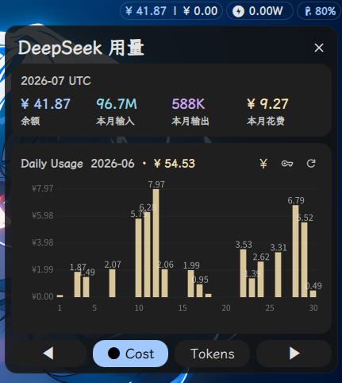
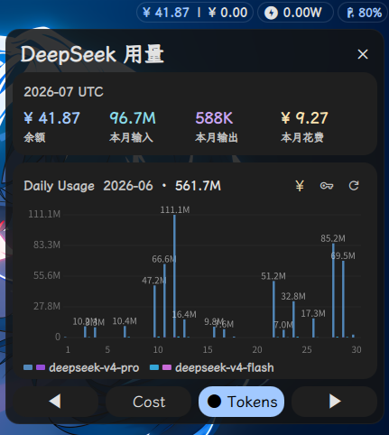

# DeepSeek API Widget

A [Dank Material Shell](https://github.com/Quickshell/DankMaterialShell) widget that displays your [DeepSeek Platform](https://platform.deepseek.com) API balance, cost, and token usage — right in your desktop bar.

> **Note:** This is a fork of [gylove1994/deepseek-dms-widget](https://github.com/gylove1994/deepseek-dms-widget) with modifications to the chart (dual cost/tokens mode, per-model stacked bars, month navigation, inline chart actions) and UI styling. Original work © 2025 gylove1994, MIT License.

## Features

- **Balance at a glance** — normal balance and today's cost in the bar pill
- **Per-API-key cost breakdown** — dropdown in the chart header to view usage/cost for each API key separately (e.g. per project), or the account total
- **Monthly breakdown** — input/output token counts and cost for the current month
- **Dual-mode daily chart** — toggle between cost (¥, single gold bars) and tokens (per-model stacked bars with input/output split)
- **Month navigation** — browse historical months cached locally; no repeated API calls
- **Per-model token view** — adjacent stacked bars for each model (e.g. v4-pro vs v4-flash), with distinct color pairs
- **Official pricing** — cost derived from DeepSeek's own monthly amount/cost APIs (not hardcoded)
- **Inline chart actions** — refresh, login (key icon), and top-up (¥ icon) in the chart header
- **Cookie auto-login** — Playwright-powered Chromium browser automates platform login
- **i18n** — English and Simplified Chinese (中文)

## Screenshots




## Requirements

- [Dank Material Shell](https://github.com/Quickshell/DankMaterialShell) >= 0.1.0
- Python 3.8+
- pip / venv
- A desktop environment with a web browser (for the initial login)

## Installation

### 1. Clone the plugin

```bash
mkdir -p ~/.config/DankMaterialShell/plugins
git clone https://github.com/gylove1994/deepseek-dms-widget.git \
  ~/.config/DankMaterialShell/plugins/DeepSeekWidget
```

### 2. Create a virtual environment

```bash
cd ~/.config/DankMaterialShell/plugins/DeepSeekWidget
python3 -m venv .venv
```

### 3. Install Python dependencies

```bash
.venv/bin/pip install -r scripts/requirements.txt
```

### 4. Install Chromium for Playwright

```bash
.venv/bin/playwright install chromium
```

> **Note:** Chromium requires certain system libraries. If installation fails, install them first:
> ```bash
> # Arch Linux
> sudo pacman -S --needed nss atk at-spi2-atk cups-libs libdrm libxkbcommon libxcomposite libxdamage libxrandr mesa gtk3 pango cairo alsa-lib
>
> # Ubuntu / Debian
> sudo apt install -y libnss3 libatk-bridge2.0-0 libcups2 libdrm2 libxkbcommon0 libxcomposite1 libxdamage1 libxrandr2 libgbm1 libpango-1.0-0 libcairo2 libasound2t64
>
> # Fedora
> sudo dnf install -y nss atk at-spi2-atk cups-libs libdrm libxkbcommon libxcomposite libXdamage libXrandr mesa-libgbm gtk3 pango cairo alsa-lib
> ```

### 5. Enable the widget

Edit `~/.config/DankMaterialShell/settings.json` and add `"deepseekWidget"` to your `barConfigs` array:

```json
{
  "barConfigs": [
    "deepseekWidget",
    "... other widgets ..."
  ]
}
```

Restart Dank Material Shell or reload the configuration for the widget to appear.

### 6. Log in

Click the widget in the bar to open the popout, then click the **key icon** (🔑) in the chart header. A Chromium window will open — log in with your DeepSeek Platform account. The browser closes automatically once authenticated.

### Python environment

This project uses an isolated virtual environment (`.venv`). Do not install into system Python unless you explicitly intend to.

### Cleanup after install

Once everything is working, you can remove files not needed at runtime to save space:

```bash
cd ~/.config/DankMaterialShell/plugins/DeepSeekWidget
rm -rf .git .gitignore .superpowers screenshots README.md LICENSE
```

Only these are required at runtime: `plugin.json`, `*.qml`, `i18n/`, `scripts/`, `.venv/`.

## Usage

### Login

1. Open the widget popout by clicking the bar pill
2. Click the **key icon** (🔑) in the chart header
3. A Chromium browser window opens — log in to [platform.deepseek.com](https://platform.deepseek.com)
4. Once logged in, the browser closes automatically and data loads

### Bar Pill

The compact bar display shows:

```
[DS]  ¥ 42.50 | ¥ 2.13
```

- Balance in your account currency
- Today's cost (not monthly)

### Popout Panel

Click the bar pill to open the full panel with:
- Current month token/cost breakdown (Balance, Input, Output, Cost)
- Daily usage trend chart with **two modes**:
  - **Cost** — single gold bars per day showing money spent
  - **Tokens** — per-model stacked bars (e.g. v4-pro + v4-flash) with input/output split
- **Month navigation** — ◀ / ▶ buttons to browse past months (data cached locally)
- **Chart header icons** — top-up (¥), login (🔑), and refresh
- **API key selector** — a dropdown under the chart header lets you switch between **All Keys** (account total) and each individual API key; the chart, monthly stats and today's cost all follow the selection (persisted between restarts)
- Bottom row: ◀ Cost Tokens ▶

### Settings

Configure via the DMS settings panel:
- **Refresh interval** — 1/5/15/30 minutes
- **Trend history months** — 1/3/6 months
- **Language** — English / 中文

## How It Works

The widget calls DeepSeek Platform's internal APIs using your session cookie:

| Endpoint | Purpose |
|----------|---------|
| `/api/v0/users/get_user_summary` | Balance, monthly summary |
| `/api/v0/usage/amount` | Token usage breakdown (monthly) |
| `/api/v0/usage/amount?group_by=day` | Daily per-model token usage |
| `/api/v0/usage/cost` | Cost breakdown (monthly, for pricing derivation) |
| `/api/v0/users/get_api_keys` | API key list (names + tracking ids) |
| `/api/v0/usage/by_api_key/amount?start=S&end=E&tz=Z` | Per-API-key usage buckets |
| `/api/v0/usage/by_api_key/cost?start=S&end=E&tz=Z` | Per-API-key cost buckets |

Per-key usage/cost is fetched from the platform's "by API key" view endpoints,
which take an epoch-second `[start, end)` range plus a whole-hour timezone
offset in seconds (exactly what the new platform UI sends). If the endpoints
are unavailable (404, older platform version), the widget simply hides the key
selector. Note that balance is account-wide — all keys share the same wallet —
so only usage and cost are broken down per key.

Pricing is derived from DeepSeek's own monthly cost ÷ token counts per model and token type, so it always matches the official platform regardless of peak/off-peak changes.

The cookie is obtained by launching a Chromium browser via Playwright, intercepting the authenticated request after you log in. The cookie is stored locally in `cookie.txt` (gitignored).

Historical daily data is cached in pluginData (`dailyCache`) so only the current month is fetched from the API on each refresh.

## Project Structure

```
├── plugin.json              # DMS plugin manifest
├── DeepSeekWidget.qml       # Main widget (bar pill + popout)
├── DeepSeekSettings.qml     # Settings panel
├── i18n/
│   ├── en_US.json           # English strings
│   └── zh_CN.json           # Chinese strings
├── scripts/
│   ├── fetch.py             # API data fetcher
│   ├── login.py             # Playwright cookie login
│   └── requirements.txt     # Python dependencies
└── screenshots/
    ├── cost-money.png       # Cost chart mode
    └── cost-token.png       # Tokens chart mode
```

## License

MIT — see [LICENSE](./LICENSE) for details.

## Disclaimer

This project is not affiliated with or endorsed by DeepSeek. It uses DeepSeek Platform's internal APIs and may break if those APIs change.
